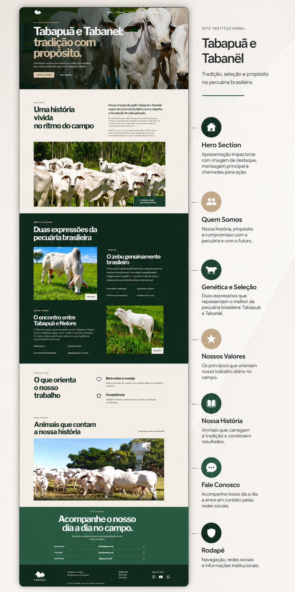

# Tabapuã SAF - Landing Page

Este projeto é uma landing page institucional para a **Pecuária Tabapuã SAF**, focada na divulgação e detalhes das raças de gado Tabanel e Tabapuã. O site apresenta diferenciais genéticos, características do rebanho e canais de contato.

## 📸 Visualização do Projeto

## 🔗 Link para Acesso

O projeto pode ser visualizado online através do link abaixo:

👉 [**Acesse a Landing Page aqui**](tabapuasaf.vercel.app)

## 🛠️ Tecnologias Utilizadas

- **HTML5**: Estrutura semântica e acessível.
- **CSS3**: Estilização moderna utilizando Variáveis CSS, Flexbox e CSS Grid.
- **JavaScript**: Animações de entrada (Intersection Observer), controle de menu mobile e efeitos de rolagem.
- **Font Awesome**: Ícones para redes sociais.
- **Google Fonts**: Fontes Montserrat e Roboto Slab.

## 📂 Estrutura de Arquivos

- `index.html`: Estrutura principal do site.
- `style.css`: Folha de estilos com design responsivo.
- `script.js`: Lógica de interatividade e animações.
- `/assets`: Pasta contendo imagens e logotipos.

---
Desenvolvido para **Tabapuã SAF**.